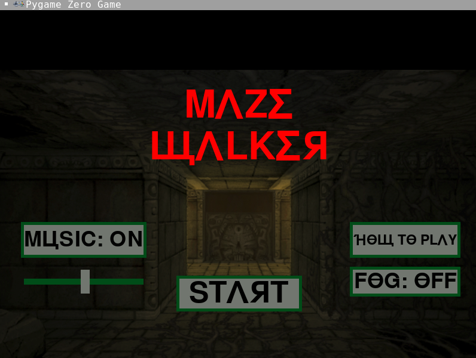
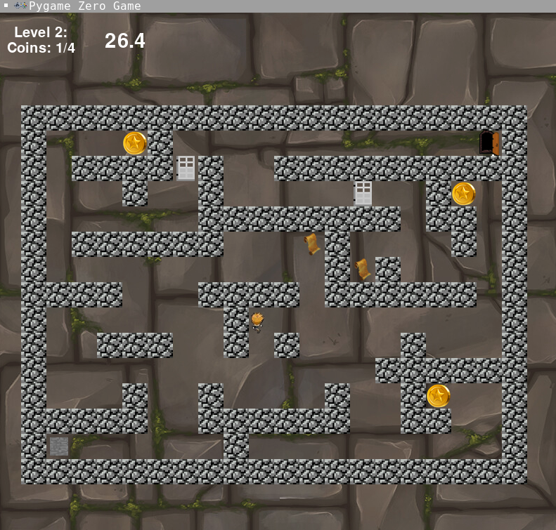
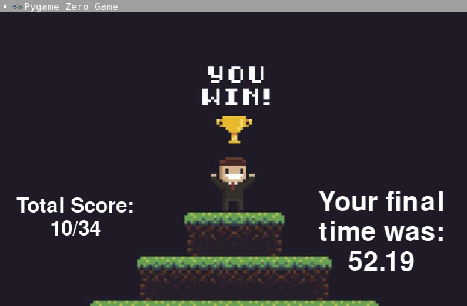
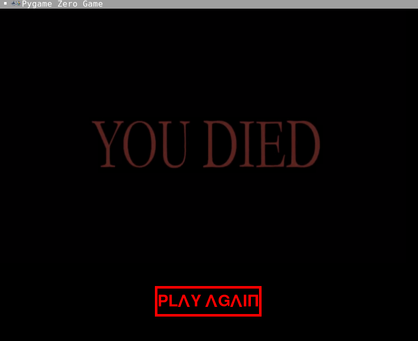

# Maze-Walker

A 2D dungeon crawler game I submitted for my grade 11 computer science culminating project.

The game was made with pygame, which helped render graphics with Python. 

## Screenshots

### Main Menu

### In Game

### Win Screen

### Death Screen

